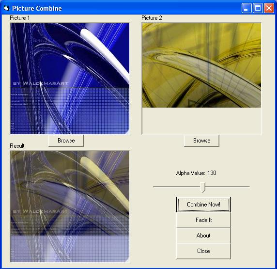



## Picture Combine

### Description

This program show how to combine two picture into one picture using alpha blend. This is actually an update version of my last time project. It is now support Window 98 or later. You can also combine and let it fade. Easy to understand with well explanation! Any vote or comment is welcome!
 
### More Info
 

             |
---                |---
**Submitted On**   |2004-08-15 06:37:16
**By**             |[Alvin Chua](https://github.com/Planet-Source-Code/PSCIndex/blob/master/ByAuthor/alvin-chua.md)
**Level**          |Intermediate
**User Rating**    |4.8 (29 globes from 6 users)
**Compatibility**  |VB 4\.0 \(32\-bit\), VB 5\.0, VB 6\.0
**Category**       |[Graphics](https://github.com/Planet-Source-Code/PSCIndex/blob/master/ByCategory/graphics__1-46.md)
**World**          |[Visual Basic](https://github.com/Planet-Source-Code/PSCIndex/blob/master/ByWorld/visual-basic.md)
**Archive File**   |[Picture\_Co1782128152004\.zip](https://github.com/Planet-Source-Code/alvin-chua-picture-combine__1-55580/archive/master.zip)

